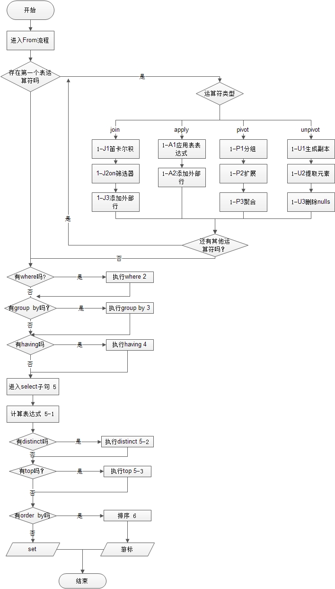

# 数据库须知概念

本文章所有代码与概念以 `SQLServer 2012` 为准。

本文章不适合无任何编程语言基础者阅读，不适合从未接触过数据库者阅读，但是你可以尝试阅读。

此篇旨在于帮助有基础者快速浏览数据库基本学习路线。

<br />

SQLServer 基本数据类型
---------

**Character 字符串**

- char(n)		固定长度的字符串 | 最多 8,000 个字符。
- varchar(n)	可变长度的字符串 | 最多 8,000 个字符。 
- varchar(max)	可变长度的字符串 | 最多 1,073,741,824 个字符。	 
- text			可变长度的字符串 | 最多 2GB 字符数据。

**Unicode 字符串**

- nchar(n)		固定长度的 Unicode 数据。最多 4,000 个字符。	 
- nvarchar(n)	可变长度的 Unicode 数据。最多 4,000 个字符。	 
- nvarchar(max)	可变长度的 Unicode 数据。最多 536,870,912 个字符。	 
- ntext			可变长度的 Unicode 数据。最多 2GB 字符数据。

**Binary 类型**

- bit			允许 0、1 或 NULL	 
- binary(n)		固定长度的二进制数据。最多 8,000 字节。	 
- varbinary(n)	可变长度的二进制数据。最多 8,000 字节。	 
- varbinary(max)可变长度的二进制数据。最多 2GB 字节。	 
- image			可变长度的二进制数据。最多 2GB字节。

**Number 类型**

- tinyint		允许从 0 到 255 的所有数字。1 字节。
- smallint		允许从 -32,768 到 32,767 的所有数字。2 字节。
- int			允许从 -2,147,483,648 到 2,147,483,647 的所有数字。4 字节。
- bigint		允许 -9,223,372,036,854,775,808 ~ 9,223,372,036,854,775,807 之间的所有数字。8 字节。
- float			-1.79E+308 至 -2.23E - 308、0 以及 2.23E - 308 至 1.79E + 308。
- real			-3.40E+38 至 -1.18E - 38、0 以及 1.18E - 38 至 3.40E + 38。
- money			8 字节。可用货币符号。
- smallmoney	4 个字节。可用货币符号。

**Date 类型**

- datetime		从 1753 年 1 月 1 日 到 9999 年 12 月 31 日，精度为 3.33 毫秒。
- date			仅存储日期。从 0001 年 1 月 1 日 到 9999 年 12 月 31 日。	3 bytes
- time			仅存储时间。精度为 100 纳秒。

**其他数据类型**

- sql_variant	存储最多 8,000 字节不同数据类型的数据，除了 text、ntext 以及 timestamp。
- xml			存储 XML 格式化数据。最多 2GB。
- cursor		存储对用于数据库操作的指针的引用。
- table			存储结果集，供稍后处理。

> 更多类型请访问 [微软官方文档](https://docs.microsoft.com/zh-cn/sql/t-sql/data-types/data-types-transact-sql?view=sql-server-2017)
> 或者 [菜鸟教程 (适合初学者)](http://www.w3school.com.cn/sql/sql_datatypes.asp)


表，字段，记录
---------

数据存在于表中，表有各个字段，每一行数据称作为记录，这里不再详细介绍。

主键，外键
---------

这些全部都是约束，用于约束你对表中数据的更改，因为你无法保证你的每一项操作都是正确的，所以加入这些约束会有好处。

主键的话，可以拥有一个独立的 ID 作为主键，并且自动递增与避免重复。

外键的话，可以让另外一个表的主键作为你的外键，那么自然你就与这个表进行关联，操作时会考虑是否合法。

分组与排序
---------

主要利用 `group by` 或 `order by` 两种关键字来进行。

当数据分组完毕之后，会产生一个虚拟表格，多个值可能存在一个字段中，所以这个时候需要使用聚合函数来进行操作，否则会报错。

排序，可以使用 `desc` 或 `asc` 进行排序。

索引
---------

类似于在书中建立一个目录，我们只需要翻找目录，就可以找到你要数据的具体页码，从而实现快速查询。

- 聚集索引      查询有序排列数据。所以在根据主键进行查询时会效率很高。
- 非聚集索引    在非聚集索引中，不重复的数据越多，那么索引的效率越高。


执行顺序
---------

**一条 SQL 语句执行是有顺序的！**

往往 `from` 关键字是最先执行，`select` 较后执行（思维需要反过来）。

请参考下图:

> 本图来源网络，在 order by 与 top 之间的顺序错误，敬请谅解。




T-SQL 逻辑处理编程
--------

很简单，主要逻辑仅有 `if` `while` `case` 等等，逻辑语法并不是很多，无需担心。

```sql
-- 逻辑编程

-- 定义变量
declare @test1 int
set @test1 = 101

-- IF
if(@test1 > 100)
	begin
		print 'Test1 > 100'
	end
else
	begin
		print 'Test1 < 100'
	end

-- While 循环
-- break是表示结束循环，与c语言中的辅助控制语句break，continue类似
while(@test1 < 200)
	begin
		set @test1+=1
	end

-- 输出 200
print 'While:' + convert(nvarchar,@test1);

-- case 给不同分数分等级
use demo
select scores.cno,scores.sno, degree=case
	when scores.degree>=90 then 'A'
	when scores.degree>=80 then 'B'
	when scores.degree>=70 then 'C'
	else 'D'
	end
from scores
```

储存过程
---------

什么是储存过程？是在大型数据库系统中，一组为了完成特定功能的 SQL 语句集，存储在数据库中，经过第一次编译后再次调用不需要再次编译，用户通过指定存储过程的名字并给出参数（如果该存储过程带有参数）来执行它。存储过程是数据库中的一个重要对象。

如果不想看抽象的定义，可以认为以高级编程语言（Java，Python 等）函数，变量等等来理解；

储存过程可以定义函数，变量，返回值，甚至有点类似于小型的编程语言。

列如简单的:
```sql
-- 请单独执行
create proc search_student(
	@class varchar(5), -- 参数
	@name varchar(4) output -- 返回值
)
as
    select @name=sname from dbo.students where students.class=@class;


-- 值得注意的是,返回的结果是最后一个,而不是一个结果集
declare @recv varchar(4)
exec search_student '95031',@recv output    --接受返回值
select @recv

```

事务
---------

事务是一种机制、是一种操作序列，它包含了一组数据库操作命令，这组命令要么全部执行，要么全部不执行。

因此事务是一个不可分割的工作逻辑单元。在数据库系统上执行并发操作时事务是作为最小的控制单元来使用的。这特别适用于多用户同时操作的数据通信系统。例如：订票、银行、保险公司以及证券交易系统等。

**事务 4 大属性：**

- 原子性(Atomicity):    事务是一个完整的操作，要么全部执行，要么全部不执行。
- 一致性(Consistency):  当事务完成时，数据必须处于一致状态。
- 隔离性(Isolation):    对数据进行修改的所有并发事务是彼此隔离的。
- 持久性(Durability):   事务完成后，它对于系统的影响是永久性的。

**T-SQL 中管理事务的语句：**

- 开始事务: begin transaction
- 提交事务：commit transaction
- 回滚事务: rollback transaction
 
**事务分类:**

- 显式事务:用 begin transaction 明确指定事务的开始。
- 隐性事务：打开隐性事务,SQL Servler 将在提交或回滚事务后自动启动新事务。无法描述事务的开始，只需要提交或回滚事务。
- 自动提交事务：SQL Server 的默认模式，它将每条单独的T-SQL语句视为一个事务。如果成功执行，则自动提交，否则回滚。

简单的事务代码:
```sql
-- 开始事务
begin tran 

declare @tran_error int;
set @tran_error=0;

begin try
    -- 其中,这里只要有一个语句发生异常,那么整个语句将都不会执行。
    -- 原先已做过的语句将会被撤销。
	insert into students(class,sname,sno,ssex,sbirthday) values('2312', '000','ssssssss', 'M', '1999-12-24');
	insert into students(class,sname,sno,ssex,sbirthday) values('000', '000','00', 'M', '1999-12-24');
	insert into students(class,sname,sno,ssex,sbirthday) values('111', '111','11', 'M', '1999-12-24');
end try
begin catch
	set @tran_error=@tran_error+1; --加分号或不加都能正常执行
end catch

-- 判断是否有错误
if(@tran_error>0)
begin
	--执行出错，回滚事务
	rollback tran ;
	print 'ERROR:' + convert(varchar,@tran_error);
end 
else
begin
	--没有异常，提交事务
	commit tran ; 
	print 'OK:' + convert(varchar,@tran_error);;
end
```

> 通常我们建议，将储存过程与事务相结合使用。

**想知道如何与储存过程结合？** [单击这里](https://github.com/Suwings/Suwings.github.io/blob/master/mine/SQLServer/%E4%BA%8B%E5%8A%A12.sql)

数据库范式
---------

什么是数据库范式？这是一种数据库设计模式的模范，一般认为，数据库应该尽可能的接近第三范式。

当然，不用刻意的去遵循，根据现实需求设计。设计数据库者如果能做到更好的反范式，那么说明它的能力越强。

> 具体信息还请去自行搜索，没有例子的话会看得很抽象，篇幅有限，不举例子。

**第一范式（1NF）** 属性不可分。是指在关系模型中，对域添加的一个规范要求，所有的域都应该是原子性的，即数据库表的每一列都是不可分割的原子数据项。

**第二范式（2NF）** 在1NF的基础上，非码属性必须完全依赖于候选码（在1NF基础上消除非主属性对主码的部分函数依赖）

**第三范式（3NF）** 在1NF基础上，任何非主属性不依赖于其它非主属性（在2NF基础上消除传递依赖）

**巴斯-科德范式（BCNF）** Boyce-Codd Normal Form（巴斯-科德范式）在1NF基础上，任何非主属性不能对主键子集依赖（在3NF基础上消除对主码子集的依赖）

**第四范式（4NF）** 要求把同一表内的多对多关系删除。

**第五范式（5NF）** 又称完美范式，从最终结构重新建立原始结构。


<br /><br />
**未完待续**
