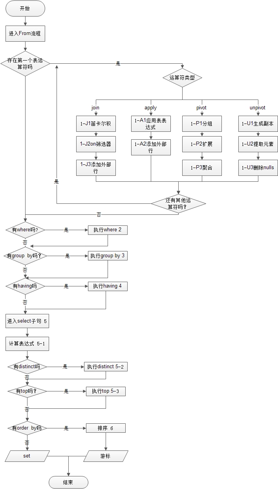

数据库须知概念
---------

表，字段，记录
---------

数据存在于表中，表有各个字段，每一行数据称作为记录，这里不再详细介绍。

主键，外键
---------

这些全部都是约束，用于约束你对表中数据的更改，因为你无法保证你的每一项操作都是正确的，所以加入这些约束会有好处。

主键的话，可以拥有一个独立的 ID 作为主键，并且自动递增与避免重复。

外键的话，可以让另外一个表的主键作为你的外键，那么自然你就与这个表进行关联，操作时会考虑是否合法。

分组与排序
---------

主要利用 `group by` 或 `order by` 两种关键字来进行。

当数据分组完毕之后，会产生一个虚拟表格，多个值可能存在一个字段中，所以这个时候需要使用聚合函数来进行操作，否则会报错。

排序，可以使用 `desc` 或 `asc` 进行排序。

索引
---------
引用于网络:
```
实际上，您可以把索引理解为一种特殊的目录。微软的SQL SERVER提供了两种索引：聚集索引（clustered index，也称聚类索引、簇集索引）和非聚集索引（nonclustered index，也称非聚类索引、非簇集索引）。下面，我们举例来说明一下聚集索引和非聚集索引的区别：

其实，我们的汉语字典的正文本身就是一个聚集索引。比如，我们要查“安”字，就会很自然地翻开字典的前几页，因为“安”的拼音是“an”，而按照拼音排序汉字的字典是以英文字母“a”开头并以“z”结尾的，那么“安”字就自然地排在字典的前部。如果您翻完了所有以“a”开头的部分仍然找不到这个字，那么就说明您的字典中没有这个字；同样的，如果查“张”字，那您也会将您的字典翻到最后部分，因为“张”的拼音是“zhang”。也就是说，字典的正文部分本身就是一个目录，您不需要再去查其他目录来找到您需要找的内容。我们把这种正文内容本身就是一种按照一定规则排列的目录称为“聚集索引”。

如果您认识某个字，您可以快速地从自动中查到这个字。但您也可能会遇到您不认识的字，不知道它的发音，这时候，您就不能按照刚才的方法找到您要查的字，而需要去根据“偏旁部首”查到您要找的字，然后根据这个字后的页码直接翻到某页来找到您要找的字。但您结合“部首目录”和“检字表”而查到的字的排序并不是真正的正文的排序方法，比如您查“张”字，我们可以看到在查部首之后的检字表中“张”的页码是672页，检字表中“张”的上面是“驰”字，但页码却是63页，“张”的下面是“弩”字，页面是390页。很显然，这些字并不是真正的分别位于“张”字的上下方，现在您看到的连续的“驰、张、弩”三字实际上就是他们在非聚集索引中的排序，是字典正文中的字在非聚集索引中的映射。我们可以通过这种方式来找到您所需要的字，但它需要两个过程，先找到目录中的结果，然后再翻到您所需要的页码。我们把这种目录纯粹是目录，正文纯粹是正文的排序方式称为“非聚集索引”。
```
- 聚集索引      查询有序排列数据。所以在根据主键进行查询时会效率很高。
- 非聚集索引    在非聚集索引中，不重复的数据越多，那么索引的效率越高。


执行顺序
---------

一条 SQL 语句执行是有顺序的。

往往 `from` 关键字是最先执行，`select` 最后执行。

请参考下图:



储存过程
---------

什么是储存过程？是在大型数据库系统中，一组为了完成特定功能的 SQL 语句集，存储在数据库中，经过第一次编译后再次调用不需要再次编译，用户通过指定存储过程的名字并给出参数（如果该存储过程带有参数）来执行它。存储过程是数据库中的一个重要对象。

储存过程可以定义函数，变量，返回值，甚至有点类似于小型的编程语言。

事务
---------

事务是一种机制、是一种操作序列，它包含了一组数据库操作命令，这组命令要么全部执行，要么全部不执行。

因此事务是一个不可分割的工作逻辑单元。在数据库系统上执行并发操作时事务是作为最小的控制单元来使用的。这特别适用于多用户同时操作的数据通信系统。例如：订票、银行、保险公司以及证券交易系统等。

事务 4 大属性：

- 原子性(Atomicity):    事务是一个完整的操作，要么全部执行，要么全部不执行。
- 一致性（Consistency)  当事务完成时，数据必须处于一致状态。
- 隔离性(Isolation):    对数据进行修改的所有并发事务是彼此隔离的。
- 持久性(Durability):   事务完成后，它对于系统的影响是永久性的。

T-SQL 中管理事务的语句：

- 开始事务: begin transaction
- 提交事务：commit transaction
- 回滚事务: rollback transaction
 
事务分类:

- 显式事务:用begin transaction明确指定事务的开始。
- 隐性事务：打开隐性事务,SQL Servler 将在提交或回滚事务后自动启动新事务。无法描述事务的开始，只需要提交或回滚事务。
- 自动提交事务：SQL Server 的默认模式，它将每条单独的T-SQL语句视为一个事务。如果成功执行，则自动提交，否则回滚。